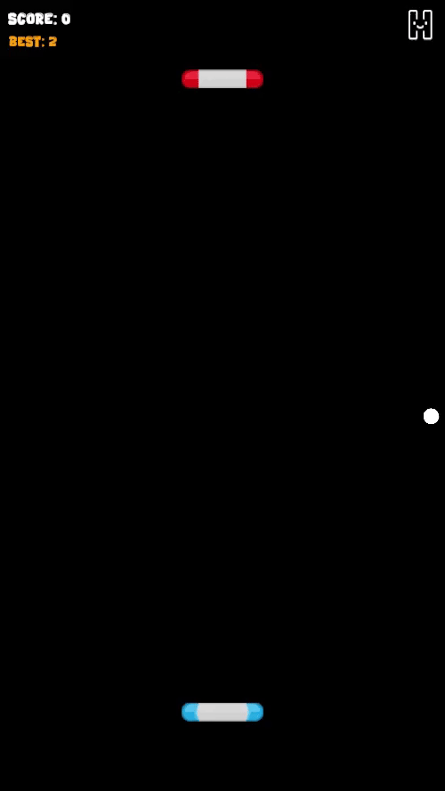

# Endless Pong 🎮

Classic Pong. One life. No second chances.

Chain your points, survive the pressure, and push your high score as far as your reflexes allow.

A fast-paced arcade experience built with Unity, designed for mobile play and playable directly in the browser.



## 🎮 Play Now

**[▶️ Play in Browser on Itch.io](https://myb-06.itch.io/endless-pong)**

No installation required! Try the game directly in your browser.

## ✨ Features

- **Adaptive AI Opponent** - Predictive ball tracking with configurable difficulty levels
- **Seamless Controls** -  Touch-first design with keyboard support for web play
- **Arcade Score System** — Chain hits, build pressure, chase your best
- **Polished Feel** - Smooth UI transitions and responsive feedback
- **Persistent Audio Settings** - Background music and SFX with persistent settings
- **High Score Tracking** - Local best score system

## 🧠 Technical Overview

The project uses a lightweight, gameplay-focused architecture designed to keep systems independent and easy to extend.

- **Decoupled Input System** — `IInputProvider` abstraction allows player and AI control to use the same paddle logic
- **Lean Game Management** — Singleton usage limited to global systems (`GameManager`, `AudioManager`, `GameBoundaries`)
- **Plain C# Gameplay Logic** — Systems like scoring handled outside MonoBehaviours
- **Scale-Appropriate Structure** — Architecture complexity matches project scope

The focus is responsive gameplay, clarity, and maintainable systems.

## 🛠️ Tech Stack

- **Unity 6000.3.2f1** 
- **Unity Input System**
- **DOTween** (Smooth animations)
- **TextMeshPro** 

## 📁 Project Structure

```
Scripts/
├── Core/              → Game management & core systems
│   ├── GameManager.cs
│   ├── ScoreManager.cs
│   └── DifficultySettings.cs
│
├── Gameplay/          → Game mechanics & physics
│   ├── Ball.cs
│   ├── Paddle.cs
│   ├── GoalZone.cs
│   ├── GameBoundaries.cs
│   └── WallManager.cs
│
├── Input/             → Input abstraction layer
│   ├── PlayerInputProvider.cs
│   └── AIInputProvider.cs
│
├── Interfaces/        → Shared interfaces
│   └── IInputProvider.cs
│
├── UI/                → User interface
│   ├── MainMenuUI.cs
│   ├── InGameUI.cs
│   └── AudioUIHelper.cs
│
└── Audio/             → Sound management
    └── AudioManager.cs
```

## 🚀 Quick Start

### Play Online
Just visit **[itch.io](https://myb-06.itch.io/endless-pong)** and play in your browser!

### Run Locally (For Developers)
1. Clone the repository
2. Open in Unity 6.3 or later
3. Install required packages via Package Manager:
   - Input System
   - TextMeshPro (usually pre-installed)
4. Import DOTween from Asset Store (free)
5. Open `Scenes/MainMenu` and press Play


## 🙏 Credits & Attributions

This project uses assets from the following creators:

### Art Assets
- **[Kenney]** - Paddle sprites (https://kenney.nl/assets/puzzle-pack)
- **[Prinbles]** - UI sprites (https://prinbles.itch.io/yet-another-icons)

### Tools & Libraries
- **DOTween** by Demigiant - [Asset Store](http://dotween.demigiant.com/)


## 📄 License

This project is open source and available under the [MIT License](LICENSE).

---

**Built with Unity 🎯 | Designed for learning and demonstration purposes**